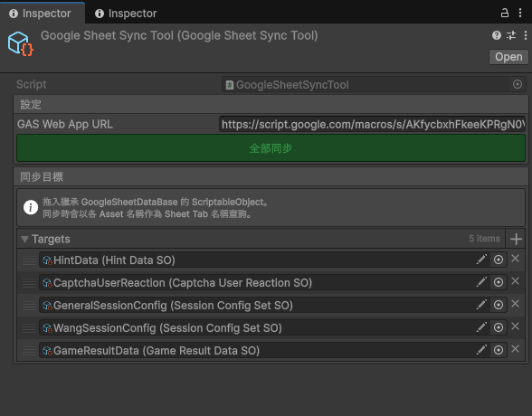

# code-showcase


## One-Click Google Sheet Sync Tool

一個 Unity Editor 工具，透過 Google Apps Script (GAS) Web App，讓企劃能一鍵將 Google Sheet 資料同步到 ScriptableObject。



### 架構

```
GoogleSheetDataBase (abstract ScriptableObject)
    └── GameResultDataSO  ← 具體資料型別，覆寫 ConvertJsonToData()

GoogleSheetSyncTool (Editor ScriptableObject)
    ├── GAS Web App URL   ← 指向已部署的 Google Apps Script
    └── Targets[]         ← 拖入任意數量的 GoogleSheetDataBase 資產
```

### 使用流程

1. **部署 GAS Web App**：在 Google Apps Script 建立並部署一個接受 `?sheet=<名稱>` 參數、回傳對應工作表 JSON 的 Web App。
2. **建立資料型別**：繼承 `GoogleSheetDataBase`，實作 `TryConvertJsonToData()` 以將 JSON 反序列化成所需的資料結構。
3. **建立同步工具資產**：在 Project 視窗右鍵 → *Tools / Google Sheet Sync Tool*，填入 GAS Web App URL。
4. **設定同步目標**：將繼承 `GoogleSheetDataBase` 的 ScriptableObject 資產拖入 Targets 列表；同步時會以各資產名稱作為 Sheet Tab 名稱查詢。
5. **一鍵同步**：點擊 Inspector 中的「**全部同步**」按鈕，工具會依序請求每個工作表的 JSON 並寫回ScriptableObject，完成後顯示成功／失敗統計。

### 技術重點

- **`GoogleSheetDataBase`**：抽象方法 `ConvertJsonToData()`保留了反序列化流程的彈性，因應不同表格的需求，最終可以解出不同的資料格式
- **`#if UNITY_EDITOR`**：所有 Editor 相依程式碼以條件編譯隔離，不影響 Runtime 建置。

### 檔案說明

| 檔案 | 說明 |
|---|---|
| `GoogleSheetDataBase.cs` | 所有可同步資料 SO 的抽象基底類別 |
| `GoogleSheetSyncTool.cs` | Editor 同步工具主體，含 HTTP 請求邏輯 |
| `GameResultDataSO.cs` | 範例：遊戲結果資料的具體實作 |
| `GameResultData.cs` | 範例：對應 Google Sheet 一列的資料模型 |
